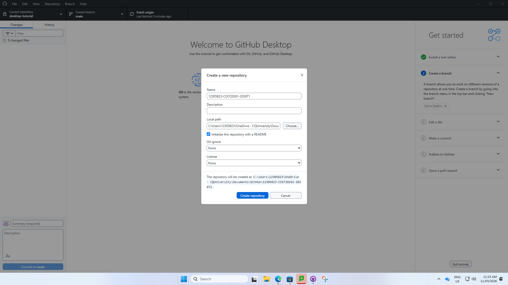

<h1 align="center">GNS3-Intro-12305823</h1>

  <b>Network Services & Automation Lab Setup</b> 
  Repository created for the GNS3 introductory assignment.

<h2>1. Project Creation</h2>

This project repository was created with the required name format:

<pre><code>GNS3-Intro-&lt;studentid&gt;</code></pre>

For my assignment, I created the repository using my actual student ID in place of
<code>12305823</code>.

<h2>2. Repository Purpose</h2>

This repository is used to store the files, screenshots, configurations, and documentation
for the GNS3 introductory network automation assignment.

<h2>3. Evidence of Repository Creation</h2>

The screenshot below is included as evidence that the repository was created successfully.

<h2>4. Notes</h2>

<ul>
  <li>The repository name follows the required naming convention.</li>
  <li>Additional assignment files, configurations, and screenshots will be added in later sections.</li>
</ul>

<b>Status:</b> Repository created successfully.

